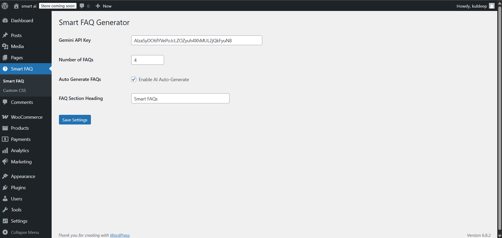
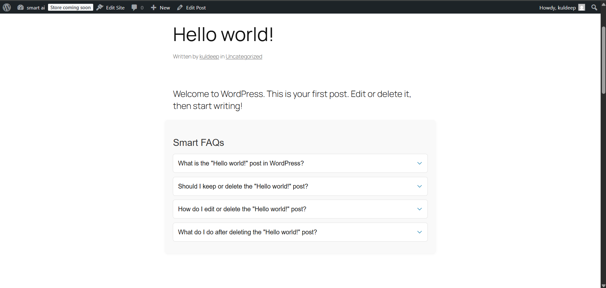

# WP Smart FAQ

A simple **WordPress plugin** to handle FAQs and improve user experience.  
It demonstrates:

- Auto-generate FAQs for posts and products using AI (Gemini API).  
- Create, read, and display FAQ content.  
- Interactive accordion-style FAQ display.  
- Customize FAQ heading, number of FAQs, and auto-generate toggle via settings page.

---

## Features

### Smart FAQ Plugin
- Adds meta box for **FAQs** in posts and WooCommerce products.  
- Auto-generates FAQs using AI (Gemini) if enabled.  
- Settings page allows:  
  - Gemini API Key  
  - Number of FAQs to generate  
  - Enable/disable auto-generation  
  - FAQ section heading  

---

## Installation (for WordPress)
1. Clone or download the repo.  
2. Upload to `wp-content/plugins/`.  
3. Activate plugin from WordPress dashboard.  
4. Go to **Settings → Smart FAQ** to configure API key, FAQ count, heading, and auto-generate toggle.  

---

## Usage
- Edit a post or product, and the FAQ meta box will appear.  
- If auto-generate is enabled, FAQs will populate automatically when saving.  
- Customize FAQ heading and number of FAQs from the settings page.  
- FAQs are displayed on the front-end as an accordion with toggle arrows.  

---

## License
MIT License – free to use and modify.

---

## Screenshots

**Settings Page**  
  

**FAQ Front-End Display**  
  

---

## Notes
- For WooCommerce support, ensure the plugin checks if `is_product()` exists.  
- FAQs can be edited manually via the meta box even if auto-generation is enabled.
